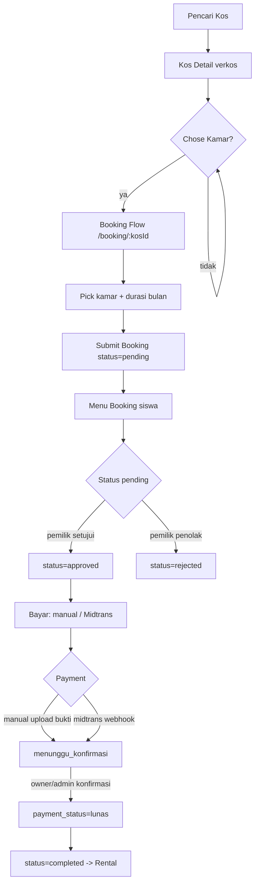
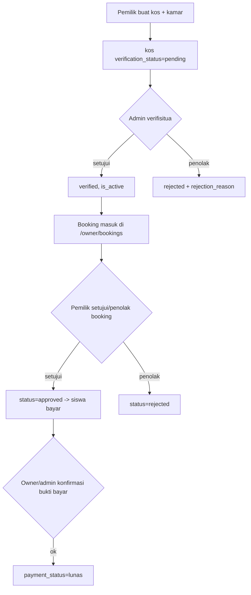
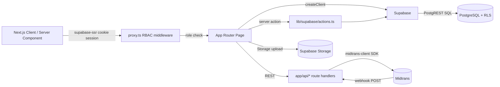
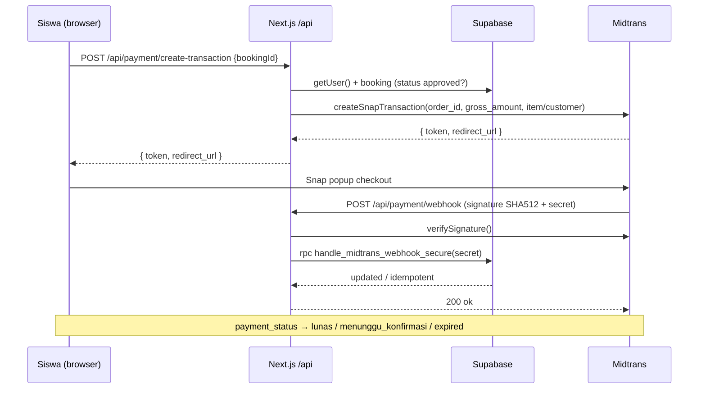
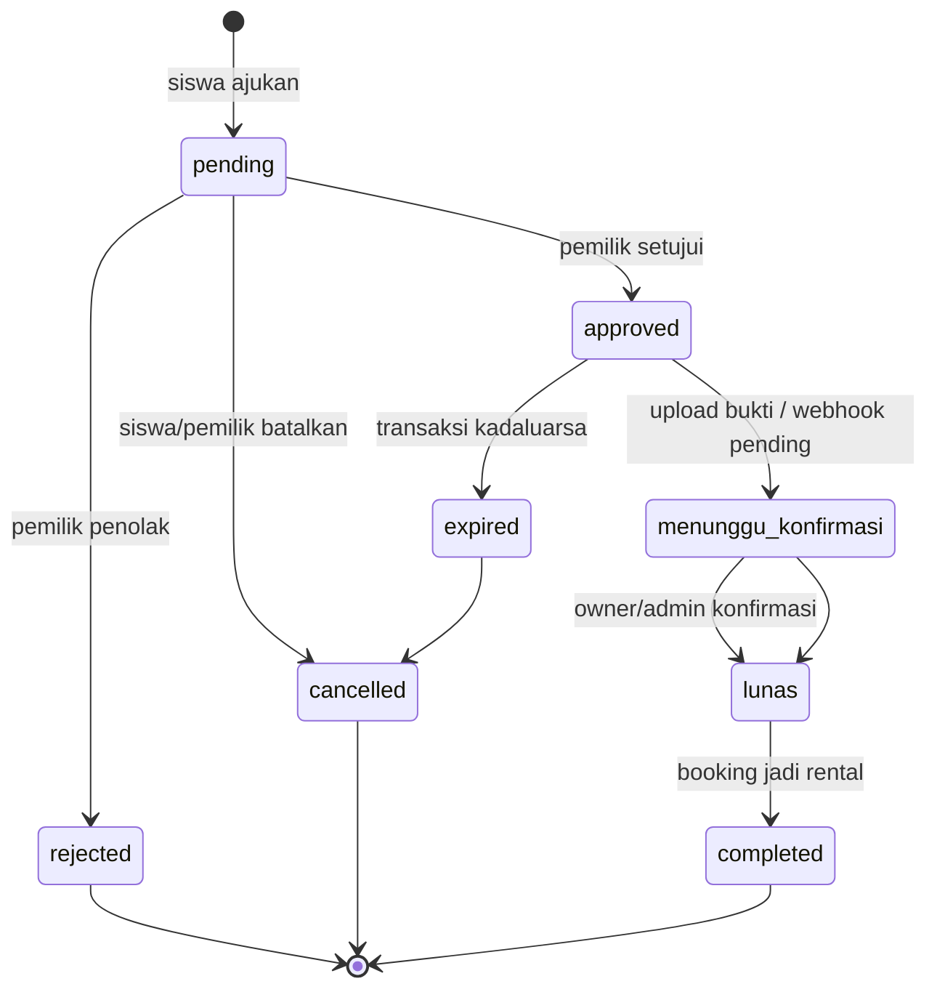
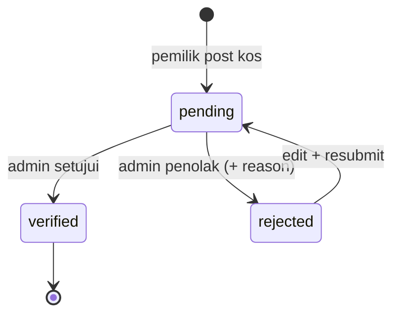
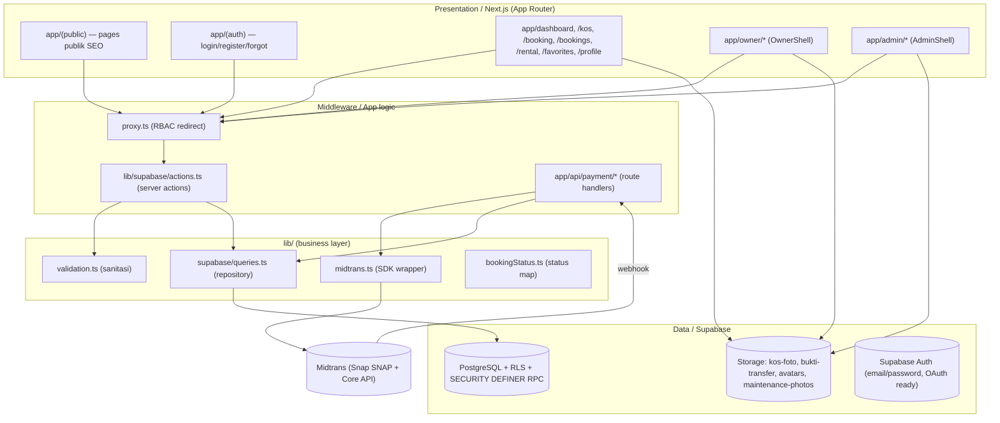
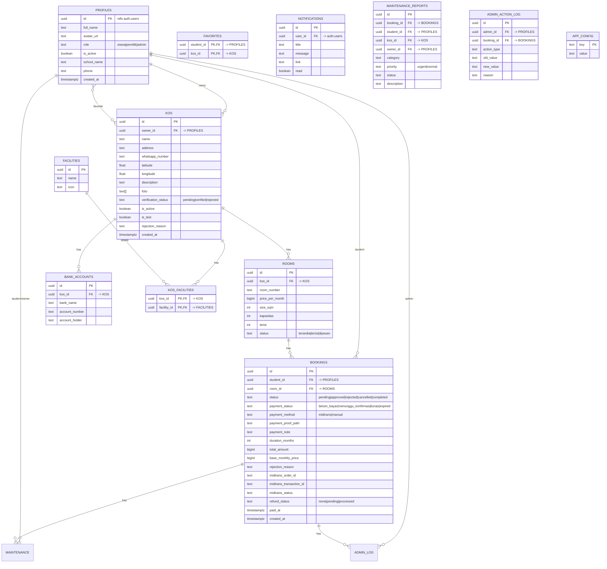

# 🏷️ NestU — Platform Pencarian Kos untuk Siswa

      

> ⚠️ Badge **Build Status** belum ditera karena CI/CD belum terkonfigurasi (lihat [Deployment](#11--deployment) → CI/CD `[TODO]`).

---

## 📑 Table of Contents

- [1. 📖 Deskripsi Singkat](#1--deskripsi-singkat)
- [2. 🎯 PRD (Product Requirements Document)](#2--prd-product-requirements-document)
- [3. 🔄 Flow Detail (Alur Sistem)](#3--flow-detail-alur-sistem)
- [4. 🏗️ Arsitektur](#4--arsitektur)
- [5. 🗂️ Struktur Folder](#5--struktur-folder)
- [6. 🗄️ Database Schema](#6--database-schema)
- [7. 🔌 API Documentation](#7--api-documentation)
- [8. ⚙️ Environment Variables](#8--environment-variables)
- [9. 🚀 Cara Instalasi & Menjalankan](#9--cara-instalasi--menjalankan)
- [10. 🧪 Testing](#10--testing)
- [11. 📦 Deployment](#11--deployment)
- [12. 📅 Roadmap / Future Work](#12--roadmap--future-work)
- [13. 🤝 Kontribusi](#13--kontribusi)
- [14. 📄 License](#14--license)
- [15. 👥 Authors / Kontak](#15--authors--kontak)
- [16. 🧹 Pengecekan Akun Test](#16--pengecekan-akun-test)

---

## 1. 📖 Deskripsi Singkat

**NestU** adalah platform web **pencarian kos (hunia kusili) terverifikasi untuk siswa dan mahasiswa di Indonesia**, dibangun dengan **Next.js (App Router)** + **Supabase** (PostgreSQL, Auth, Storage) dan pembayaran online via **Midtrans**. Siswa bisa mencari kos dekat sekolahmu, filter kamar berdasarkan harga/tipe/fasilitas, favorit hunian, dan membuat **booking kamar secara online**; pemilik kos bisa mempublikasi &amp; mengelola listing, menyetujui/penolak booking, dan konfirmasi pembayaran; admin verifisitua listing, mengelola user, booking, refund, dan override status.

**Masalah yang diselesaikan:** listing kos sering tidak terpercaya, harga tidak transparan, dan proses booking/pembayaran masih offline — sehingga siswa susa menemukan hunian aman dan pemilik kos banyak tugas manual.

**Target user:** siswa/mahasiswa yang mencari hunian (role `siswa`), pemilik kos yang ingin mengisi kamar (role `pemilik`), dan operator platform/admin (role `admin`).

---

## 2. 🎯 PRD (Product Requirements Document)

### Latar Belakang / Problem Statement
- Listing kos tidak terverifikasi → siswa tidak bisa kepercaya info hunian.
- Proses booking + pembayaran manual &amp; offline → pemilik overrun, siswa tidak punya rasa keamanan.
- Tidak ada dasabo kelola utk pemilik kos dan admin.

### Tujuan (Goals)
- Listing kos yang **terverifikasi** (admin review sebelum go publik).
- **Pencarian &amp; filtering** kos berdasarkan lokasi, harga, tipe, fasilitas.
- **Booking online** flow end-to-end (ajukan → setujui → bayar → completed).
- **Pembayaran transparan**: manual transfer (bukti upload) + online via **Midtrans Snap**.
- **Dashboard role-based**: siswa, pemilik kos, admin.
- **Keamanan data** via **Row Level Security (RLS)** + **SECURITY DEFINER** fungsi admin-only.

### Non-Goals (yang TIDAK masuk scope)
- Aplikasi mobile native (web/PWA only — BottomNav mobile).
- Escrow pembayaran (dana pembayaran ke pemilik kos, bukan menjamu NestU).
- Marketplace multi-tenant generik — fokus niche hunian siswa.
- `[TODO: perlu dilengkapi]` — file PRD.md asli tidak ditemu di repo.

### Target User / Persona
| Persona | Role | Kebutuhan |
|---|---|---|
| Siswa | `siswa` | Cari kos terverifikasi dekat sekolah, compare harga/fasilitas, favorit, booking &amp; bayar online |
| Pemilik Kos | `pemilik` | Post listing kos + kamar, kelola booking masuk, konfirmasi pembayaran, laporan maintenance |
| Admin | `admin` | Verifisitua listing, kelola user (suspend / ubah role), refund, override booking status |

### User Stories
- Sebagai **siswa**, saya ingin **mencari kos dengan filter (lokasi, harga, fasilitas)** agar saya bisa cepat menemukan hunian sesuai budget.
- Sebagai **siswa**, saya ingin **buat booking kamar online** agar saya tidak perlu datang fisik.
- Sebagai **siswa**, saya ingin **bayar via buttonal / upload bukti transfer** agar hunian terkonfirmasi dari rumah.
- Sebagai **pemilik kos**, saya ingin **mempublikasi kos + kamar** agar kamar kosong terlihat siswa.
- Sebagai **pemilik kos**, saya ingin **menyetujui/penolak booking** agar saya control status hunian saya.
- Sebagai **admin**, saya ingin **verifisitua kos sebelum go publik** agar listing yang ditampil terpercaya.
- Sebagai **admin**, saya ingin **suspend / ubah role user** agar ekosistem tetap order.

### Functional Requirements
1. Auth &amp; role (email/password via Supabase Auth, OAuth callback ready).
2. Role-Based Access Control (RBAC) di middleware + RLS di DB.
3. CRUD kos + kamar (owner), verifikasitua (admin).
4. Pencarian/filter/sort/pagination kos publik.
5. Favorit kos (student).
6. Booking flow multi-status (pending → approved → payment → completed).
7. Pembayaran manual (upload bukti) + Midtrans Snap (webhook + signature).
8. Notifikasi in-app (per user).
9. Admin panel: dasbo, verifisitua kos, booking, refund, kelola user, override status, log.
10. Laporan maintenance (student submit → owner kelola).
11. SEO &amp; pages publik (about, contact, terms, privacy, partner, developer).

### Non-Functional Requirements
- **Security:** RLS di semua recovery tabel; fungsi `SECURITY DEFINER` + validasi `is_admin()`; webhook Midtrans signature SHA512 + shared secret; sanitasi input (`validation.ts`).
- **Performance:** pagination + limit listing; skeleton loading.
- **Scalability:** serverless Vercel + Supabase; indeks di kolom filter (is_active, payment_status).
- **Maintainability:** sumber sentral: `queries.ts`, `bookingStatus.ts`, `constants/routes.ts`, `seo.ts`.
- **UX:** Bahasa Indonesia, Material-based design token (Tailwind), responsive (sidebar desktop + bottom-nav mobile).

### Success Metrics / KPI
- `[TODO: perlu dilengkapi]` — metrik bisnis asli (booking conversion, payment success rate) tidak ditera di repo.
- Teknis: count booking per status, refund pending queue, kos verified vs pending (via admin dasbo).


---

## 3. 🔄 Flow Detail (Alur Sistem)

### 3.1 User Flow — Booking Kamar (siswa)



### 3.2 User Flow — Pemilik Kos &amp; Admin



### 3.3 System Flow / Architecture Flow (data frontend → backend → DB)



### 3.4 Business Logic Flow — Pembayaran Midtrans (sequence)



### 3.5 State Diagram — Booking



### 3.6 State Diagram — Kos (Verifikasitua)



---

## 4. 🏗️ Arsitektur

### Diagram Arsitektur



### Penjelasan Layer

- **Presentation layer:** Next.js App Router. Kombinasi Server Component (data fetch via `lib/supabase/server.ts`) + Client Component (`"use client"`). Layout shell per role: `AdminShell`, `OwnerShell`, `Sidebar` (siswa/owner), `TopNav`, `Footer`, `BottomNav` (mobile), `PublicHeader`.
- **Middleware layer:** `proxy.ts` — RBAC guard. Path publik/auth → pass; protected path senza auth → `/login?redirect=...`; role wrong → home role. Config `matcher` untuk exclude static/API/fonts/seo (salah raw Google verification file).
- **Business layer:** `lib/supabase/queries.ts` (query DB, repository pattern), `lib/supabase/actions.ts` (server actions: logout, approve/reject kos, favorite, booking submit), `lib/midtrans.ts` (SDK wrapper), `lib/validation.ts` (sanitasi &amp; validasi), `lib/bookingStatus.ts` (status → label/color), `lib/seo.ts`, `lib/constants/routes.ts` (route per role).
- **Data layer:** Supabase PostgreSQL dengan **RLS** per tabel + **SECURITY DEFINER** fungsi (bypass RLS, role/secret check explicit): `is_admin()`, `get_users_with_email()`, `handle_midtrans_webhook_secure()`, `admin_override_booking_status()`, `get_available_room_ids()` (migration 034).

### Tech Stack (versi dari `package.json` / config)

| Layer | Teknologi | Versi |
|---|---|---|
| Framework | Next.js (App Router, `--webpack`) | 16.2.11 |
| UI | React | 19.2.4 |
| Language | TypeScript | ^5 |
| Styling | Tailwind CSS + PostCSS | 4 |
| Backend/DB/Auth/Storage | Supabase (`@supabase/ssr`, `@supabase/supabase-js`) | 0.12.3 / 2.110.8 |
| Payment | Midtrans (`midtrans-client`) | 1.4.3 |
| Map | Leaflet + react-leaflet | 1.9.4 / 5.0.0 |
| Toast | sonner | 2.0.7 |
| Deploy | Vercel (veto dari env `.env.local`) | — |

### Design Pattern
- **App Router + Server Actions** (mutation via action, guard server-side).
- **Repository pattern** (`queries.ts` centralizza query Supabase).
- **Defense-in-depth**: RLS + `SECURITY DEFINER` RPC + explicit role check (`is_admin()`) + signature/secret webhook.
- **Single-source-of-truth** config: `constants/routes.ts`, `seo.ts`, `bookingStatus.ts`.
- **Skeleton loading** (`loading.tsx` per halaman) untuk UX.
---

## 5. 🗂️ Struktur Folder

```
├── app/                         # Next.js App Router (pages + routes)
│   ├── (auth)/                  # login, register, forgot-password layout
│   ├── (public)/                # pages publik SEO: home, about, contact, terms, privacy, partner, developer
│   ├── admin/                   # AdminShell area: /, kos, bookings, users, refunds, overrides
│   ├── api/payment/             # Route handler: create-transaction, webhook (Midtrans)
│   ├── auth/callback/           # OAuth callback (exchange code → session)
│   ├── owner/                   # OwnerShell area: /, kos(+new/[id]/edit), bookings, reports, profile, settings
│   ├── booking/[kosId]/         # Flow booking kamar
│   ├── bookings/                # List/detail booking siswa
│   ├── dashboard/               # Dashboard siswa
│   ├── favorites/               # Favorit kos siswa
│   ├── rental/                  # My rental (completed booking) + report maintenance
│   ├── kos/                     # Listing + detail kos (publik)
│   ├── layout.tsx                # Root layout (font, Toaster, RouteProgressBar)
│   ├── globals.css              # Tailwind + design token
│   ├── sitemap.ts               # SEO sitemap
│   └── robots.ts                # SEO robots
├── components/                  # UI + layout komponent
│   ├── layout/                  # AdminShell, OwnerShell, Sidebar, TopNav, Footer, BottomNav, PublicHeader, NotifBell
│   ├── kos/                     # FilterSidebar, FilterChips, MapToggleButton
│   ├── ui/                      # button, input, modal, Logo
│   └── *.tsx                    # KosCard, RegisterForm, DashboardHero, etc.
├── lib/                         # Business/service layer
│   ├── supabase/                # client.ts, server.ts, queries.ts, actions.ts
│   ├── constants/routes.ts      # Centralized route per role
│   ├── midtrans.ts              # Midtrans SDK wrapper
│   ├── validation.ts            # Server-side sanitasi
│   ├── bookingStatus.ts         # Booking status map
│   └── seo.ts, facilities.ts, types.ts, utils.ts
├── migrations/                  # SQL migration Supabase (002 → 036 + README_MIGRATION.md)
├── scripts/                     # Utilitas dev: fix icons, gen_session, qa_routes, scan_dead_code
│   └── tests/                   # E2E/RBAC/RLS test scripts (node *.mjs)
├── hooks/                       # Custom React hooks
├── public/                      # Statics (images, fonts)
├── types/                       # Type type declaration
├── scratch/                     # Ad-hoc QA scripts (gitignored)
├── proxy.ts                     # RBAC middleware
├── next.config.ts               # Next config (image remote patterns)
├── tailwind.config.ts           # Design token (Material-based)
├── eslint.config.mjs / postcss.config.mjs / tsconfig.json
└── package.json                 # Dependencies & scripts
```

**Penjelasan folder penting:**
- **`app/`** — App Router: page sebagai route; layout per grup; API route di `app/api/*`.
- **`lib/supabase/`** — interaksi Supabase: `client.ts` (browser SSR client), `server.ts` (server client cookie), `queries.ts` (repository), `actions.ts` (server actions).
- **`migrations/`** — sejarah schema SQL (RLS, payment, storage, maintenance, admin).
- **`scripts/tests/`** — test E2E via Supabase client (RLS, RBAC, payment proof, maintenance).
- **`proxy.ts`** — RBAC guard per request Next.js.
- **`scratch/`** — tool QA ad-hoc (gitignored via `.gitignore`).
---

## 6. 🗄️ Database Schema

> Catatan: schema **base** (`profiles`, `kos`, `rooms`, `bookings`, `favorites`, `facilities`, `kos_facilities`) tidak punya migration CREATE TABLE asli di `migrations/` (migration dimulai dari `002`, semua `ALTER`/fix). Kolom direkonstruksitua dari `lib/types.ts`, `queries.ts`, dan migration fixing. DDL base original: `[TODO: perlu dilengkapi]`.

### ERD



### Penjelasan Entitas Utama
- **profiles** — profil per user (role menentukan area RBAC). `is_active=false` = suspend (check di login). View `profiles_public` fire `id, full_name, avatar_url, school_name, phone` untuk owner/admin (RLS bypass, select publishable aman).
- **kos** — listing hunian. `verification_status` pending→verified/rejected (admin). `is_test=true` hide dari listing publik.
- **rooms** — kamar per kos, `status` cek keterisi.
- **bookings** — harti booking + payment. Trigger enforce: student TIDAK bisa set `payment_status` ke `lunas`/`expired` (migration 019); booking unique aktif per room (migration 031); completed requiere lunas (025).
- **favorites** — junction composite (student_id, kos_id), TIDAK punya `id`.
- **notifications** — in-app notif per user (trigger `notify_*`).
- **maintenance_reports** — laporan maintenance (student submit, owner kelola) + storage photo.
- **admin_action_log** — log override status booking (audit admin).
- **Storage buckets:** `kos-foto`, `bukti-transfer` (proof payment), `avatars`, `maintenance-photos` — private RLS per role.

### Storage &amp; Security
- RLS aktif di: `profiles`, `bookings`, `kos`, `favorites`, `bank_accounts`, `notifications`, `maintenance_reports`, `admin_action_log`, storage objects.
- Helper `is_admin()` (SECURITY DEFINER) per guard policy; fungsi `get_users_with_email()` (admin-only) per admin panel lihat email di `auth.users` (migration 036).
---

## 7. 🔌 API Documentation

> NestU mostly pakai **server actions** + **direct Supabase client** (well Supabase exposes PostgREST REST API semutilisasi `NEXT_PUBLIC_SUPABASE_URL/rest/v1/**`). HTTP endpoint eksplit yang project defini sendiri ada 3:

Base URL: `https://<supabase-id>.supabase.co` (db), app URL: `https://nestuu.vercel.app`.

### 7.1 POST `/api/payment/create-transaction`
Buat transaksi Midtrans Snap untuk booking. **Auth:** hanya student pemilik booking (session cookie + `student_id` match).

Request:
```jsonc
// body (JSON)
{ "bookingId": "11111111-2222-3333-4444-555555555555" }
```

Response 200:
```jsonc
{ "token": "e80a92b9-...", "redirect_url": "https://app.midtrans.com/snap/v2/vtweb/..." }
```
`warning` opsional jika order_id gagal tersimpan (duplikat guard / reuse order_id lama).

Error:
| Status | Kondision |
|---|---|
| 400 | `bookingId wajib`, `Booking belum disetujui`, `Booking sudah lunas` |
| 401 | `Harus login` |
| 403 | `Bukan booking milik Anda` |
| 404 | `Booking tidak ditemukan` |
| 500 | `Gagal membuat transaksi: ...` / `Midtrans belum dikonfigurasi` |

### 7.2 POST `/api/payment/webhook`
Webhook Midtrans Payment Notification. **Auth:** signature SHA512 (`order_id + status_code + gross_amount + MIDTRANS_SERVER_KEY`) + `MIDTRANS_WEBHOOK_SECRET` (double check inside RPC). `GET` → health check `{"status":"ok"}`.

Flow:
```js
// body (Midtrans POST)
{ order_id, status_code, gross_amount, signature_key, transaction_status, fraud_status, transaction_id }
```
- Map `transaction_status`: `settlement`/`capture` → `lunas` (except `capture`+`fraud_status=challenge` → `menunggu_konfirmasi`); `pending` → `menunggu_konfirmasi`; `expire`/`cancel`/`deny` → `expired`; else `belum_bayar`.
- Update via RPC `handle_midtrans_webhook_secure(order_id, transaction_id, midtrans_status, payment_status, webhook_secret, gross_amount)`.

Response 200: `{ "status": "ok", "idempotent": true|false }` (idempotent se true kalau sudah lunas).

Error: 403 `Invalid signature`, 400 `Order not found`, 500 `Webhook misconfigured` / `Update failed` / `Internal error`.

### 7.3 GET `/auth/callback`
OAuth callback (exchange `?code=` → session via `supabase.auth.exchangeCodeForSession`). Redirect to `?redirect=` or `/`. **Auth:** public.

### 7.4 RPC Database (SECURITY DEFINER / internal, bukan HTTP app)
| RPC | Role | PPo |
|---|---|---|
| `is_admin()` | anon, authenticated | check role admin |
| `get_users_with_email()` | authenticated (admin-only check) | lihat semua users + email `auth.users` |
| `handle_midtrans_webhook_secure()` | service_role only + secret | update payment status webhook |
| `admin_override_booking_status()` | admin | override status booking manual |
| `get_available_room_ids()` | public | room_id yang sedang aktif booking (migration 034) |
| Trigger `enforce_student_payment_only`, `notify_*`, `enforce_completed_requires_lunas`, `booking_unique_active` | — | guard / notif auto |
---

## 8. ⚙️ Environment Variables

File: `.env.local` (local) / Vercel Environment (prod). **`.env*` dati gitignored** — cuma `.env.example` yang bisa di-commit. `[TODO: perlu dilengkapi]` — file `.env.example` belum ada di repo; contoh di bawah dari variable yang project baca.

| NAMA | Deskripsi | Contoh | Wajib? |
|---|---|---|---|
| `NEXT_PUBLIC_SUPABASE_URL` | URL project Supabase | `https://fwdbfikwckhvpbmenydq.supabase.co` | ✅ |
| `NEXT_PUBLIC_SUPABASE_ANON_KEY` | Anon (publishable) key Supabase | `sb_publishable_...` | ✅ |
| `MIDTRANS_SERVER_KEY` | Server key Midtrans (secret) | — | ✅ (payment) |
| `NEXT_PUBLIC_MIDTRANS_CLIENT_KEY` | Client key Midtrans (frontend) | — | ✅ (payment) |
| `MIDTRANS_IS_PRODUCTION` | Mode Midtrans prod vs sandbox | `true` / `false` | ✅ (payment) |
| `MIDTRANS_WEBHOOK_SECRET` | Shared secret webhook (== `app_config.midtrans_webhook_secret`) | — | ✅ (payment) |
| `NEXT_PUBLIC_SITE_URL` | Base URL produksi (SEO/OG) | `https://nestuu.vercel.app` | opsional (fallback `http://localhost:3000`) |
| `SUPABASE_SERVICE_KEY` | Service role key (solo admin/cleanup) | — | ❌ opsional (non-kode prod) |

> ⚠️ `MIDTRANS_WEBHOOK_SECRET` value harus IDENTICAL dengan `app_config.midtrans_webhook_secret` di DB (via `migrations/setup_webhook_secret.sql`). Kalau beda, webhook ditolak.
---

## 9. 🚀 Cara Instalasi & Menjalankan

### Prerequisites
- Node.js ≥ 18 (recommended 20; project verifysiko via `node --version` — dev test pada v24)
- Supabase project (URL + anon key)
- Midtrans account (test/prod) untuk pembayaran
- Access migrations SQL (via Supabase Dashboard → SQL Editor)

### Langkah Instalasi

```bash
# 1. Clone repo
git clone <YOUR_REPO_URL>
cd sle

# 2. Install dependency
npm install

# 3. Isi environment (lihat sezione Environment Variables)
#    copy .env.example → .env.local  (catatan: .env.example belum ada → buat manual)
cp .env.example .env.local   # adjust vars

# 4. Jalankan migration SQL di Supabase
#    - Apri Supabase Dashboard → SQL Editor → run file di migrations/ in order
#    - Pipa: run default schema base + migration 002 → 036
```

> `[TODO: perlu dilengkapi]` — script automation migrate (supabase CLI / db push) belum konfiguratu; migration saat ini run manual via Dashboard.

### Menjalankan Dev

```bash
npm run dev
# open http://localhost:3000
```

### Menjalankan Prod Build

```bash
npm run build
npm run start
```

### Menjalankan Test

```bash
# Test E2E / RBAC / RLS (script node independent, butuh supabase env + test account login)
node scripts/tests/rls_verify.mjs
node scripts/tests/rls_verify_after.mjs
node scripts/tests/rls_e2e.mjs
node scripts/tests/test_booking.mjs
node scripts/tests/test_payment_proof_rls.mjs
node scripts/tests/test_maintenance_e2e.mjs
node scripts/tests/e2e_full_test.mjs
```

> ⚠️ Test scripts bahala gakun test (`test_admin@sle.test` etc.) at `@sle.test`. Lihat sezione [16. 🧹 Pengecekan Akun Test](#16--pengecekan-akun-test) untuk pola &amp; cleanup.
---

## 10. 🧪 Testing

- **Framework:** tidak punya test runner unit formal (Jest/Vitest) — testing asli via **script Node.js e2e** yang menggunakan Supabase client standalone (`scripts/tests/*.mjs`, `scratch/*.mjs`). Typecheck via `tsc --noEmit`; lint via `npm run lint` (eslint-next).
- **Scope test:** RLS policy, RBAC per role, booking flow, payment proof (RLS storage), maintenance reports, e2e full.
- **Coverage:** `[TODO: perlu dilengkapi]` — coverage utilitas/job tidak ditera.
- **Account test:** pola `@sle.test` — canonical `test_admin/pemilik/siswa[_2]` (da gli script), ephemeral `qa_*` per-run (dibersihkann di akhir — lihat sezione 16).

```bash
# Typecheck
npx tsc --noEmit -p tsconfig.json

# Lint
npm run lint

# E2E sample
node scripts/tests/rls_e2e.mjs
```

> Catatan: `npm run build` (point di package.json) juga run TypeScript typecheck — buat pass gakun check penting.
---

## 11. 📦 Deployment

- **Platform:** **Vercel** (Next.js). Remote pattern deploy (img remoto Supabase/Unsplash/Google via `next.config.ts`).
- **CI/CD:** `[TODO: perlu dilengkapi]` — config GitHub Actions / Vercel CLI tidak ditemu di repo. Build currently via `npm run build`.
- **Deploy manual:**
  1. Isi env vars di Vercel Project Settings → Environment (sezione 8).
  2. Push ke branch `/main` (Vercel Git integration) atau
  3. `vercel --prod` (kli CLI pas remote).
- **Catatan produzione:** image remote careful (remotePatterns), OAuth redirect URI di-set jadi `https://nestuu.vercel.app` (OAUTH_SETUP.md), Google Search Console verification (`/googleab080d559f3e14a4.html` + meta), sitemap/robots.
---

## 12. 📅 Roadmap / Future Work

Dal commit history (`git log`) &amp; code marker:
- **OAuth (Google/Facebook):** endpoint `/auth/callback` + `app/(auth)/layout.tsx` sudah ready, ma provider jaringan OAuth belum di-enable (docs `OAUTH_SETUP.md`).
- **Completed/full thumbnail flow:** status booking `completed`, tanggal move-in flow di `/rental`; still `[TODO: perlu dilengkapi]` — uji eskena renewal/past-due rent.
- **Refund admin queue:** manual refund flow sudah (mig 020/022, `AdminRefundsContent`); still [TODO] — integrasi payment gateway refund /dana return otoma.
- **Sync role log &amp; audit:** `admin_action_log` override exists; expansion audit actions `[TODO]`.
- Po mark `[TODO: perlu dilengkapi]` lain sepanjang codebase cek `grep -r TODO app lib components`.

## 13. 🤝 Kontribusi

> `[TODO: perlu dilengkapi]` — file `CONTRIBUTING.md` belum ada. Recommendation pola, berdasarkan convention repo:

1. Fork &amp; branch feature, branch dari `main`.
2. Convention commit: `feat(...)` / `fix(...)` / `style(...)` / `security(...)` (lihat history `git log`).
3. Jalankan `npm run build` + `npm install` sebelum PR (build loh ew typecheck).
4. Jika perubahan schema DB, buat migration SQL baru `migrations/0XX_*.sql` + update `README_MIGRATION.md`.
5. Open PR → review maintainer; branch `main` protected.
6. Catatan: `scratch/` tidak di-commit (gitignored).

## 14. 📄 License

**`[TODO: perlu dilengkapi]`** — belum punya file `LICENSE` &amp; package.json `license` field tidak terdapat. Lia perlu choose lisensi (mit/other) &amp; add.

## 15. 👥 Authors / Kontak

- Solo maintainer/dibangun: **Rameyy00** — `zolaziyan2616@gmail.com` (git author semua commit).
- `[TODO: perlu dilengkapi]` — kontak tambahan/link sosmed/company tidak ditera.

## 16. 🧹 Pengecekan Akun Test

Semua script automated/e2e buat akun di domain **`@sle.test`**:

- **Canonical/persistent** (`test_*`): `test_admin@sle.test`, `test_pemilik@sle.test`, `test_siswa@sle.test`, `test_siswa_2@sle.test`, `test_pemilik_2@sle.test` — driver login asli, **kesimpan**.
- **Ephemeral/per-run** (`qa_*<suffix>@sle.test`): buat setiap run + **dibersihkann di akhir** (post-verification).

> ⚠️ **Rule:** setiap script test yang `auth.signUp` akun harus cleanup akun + data terkait (kos/rooms/bookings/logs) **di akhir**. Referen pola cleanup: `scratch/qa/cleanup_final.mjs`.

**Audit leftover test account:** run report read-only:
```bash
node scratch/qa/audit_test_accounts.mjs
```
Login `test_admin`, print setiap `@sle.test` account + role + created_at + count kos/bookings. Tidak mengubah data (read-only).

**Removing leftover auth account:** public anon/admin client **tidak bisa** delete `auth.users` (no service-role key di repo). Delete: dengan `SUPABASE_SERVICE_KEY` (`auth.admin.deleteUser`) atau **manual** di Supabase Dashboard → Authentication → Users.